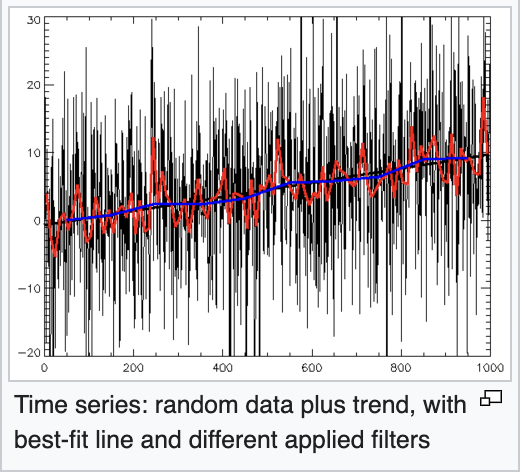
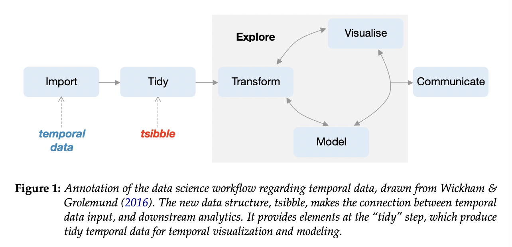
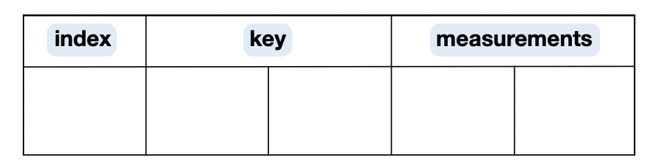
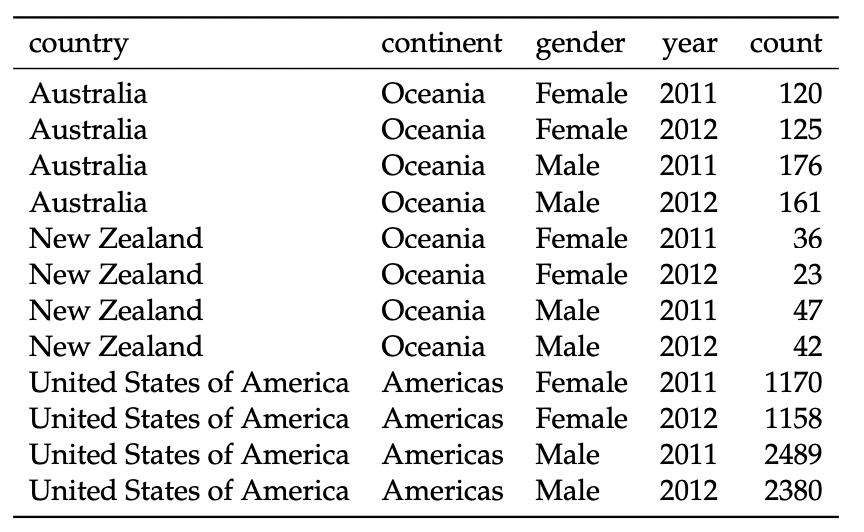
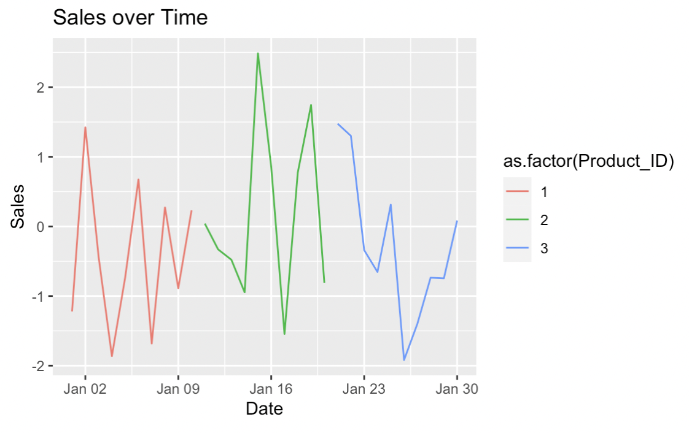
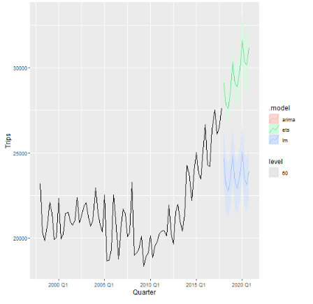

# Table of contents

<br>

1. [Basics](#basics)
2. [Tsibble](#tsibble)
3. [Fable](#fable)
4. [Summary](#summary)
5. [Tutorial](#tutorial)
6. [References](#references)

---

# Our presentation in a nutshell

.pull-left[
### R Packages for Data Science : Introduction to Tsibble and Fable 

**Temporal data with tsibble and fable** : 

1. Introduction to the Tsibble Package for Time-Series Analysis
2. Introduction to the Fable Package for Time-Series forecasting
3. Tutorial
]

.pull-right[
<div align="center">
<br>


</div>
]

.pull-right[
<div align="center">
<br>


</div>
]


---
class: inverse, center, middle
name: tsibble

# Tsibble Basics: Introduction to the Tsibble Package for Time-Series Analysis
<html><div style='float:left'></div><hr color='#EB811B' size=1px style="width:1000px; margin:auto;"/></html>

---

# What is the Tsibble Package?

.pull-left[
### R Packages for Data Science

- Let's take it from the [tsibble website](https://tsibble.tidyverts.org/):

**"The tsibble package provides a data infrastructure for tidy temporal data with wrangling tools."**

It is part of the 'tidyverts' packages who has been mostly done by Earo Wang and Mitchell O'Hara-Wild.
]


.pull-right[
<div align="center">
<br>

 <p style="text-align: center; font-size: 16px; font-weight:">image from: earo</p>

</div>
]

.pull-right[
<div align="center">
<br>

 <p style="text-align: center; font-size: 16px; font-weight:">image from: Acems</p>

</div>
]

---

# A Guide to Tsibble

### Valuable Resources

- [Tsibble : RDocumentation](https://www.rdocumentation.org/packages/tsibble/versions/1.1.3)
- [Tsibble : learn more about tsibble](https://tsibble.tidyverts.org/) 
- [Tsibble : tidy temporal data frames and tools](https://search.r-project.org/CRAN/refmans/tsibble/html/tsibble-package.html)
- [Tsibble : CRAN](https://cran.microsoft.com/snapshot/2022-05-21/web/packages/tsibble/tsibble.pdf)
- [Tsibble : example](https://robjhyndman.com/hyndsight/tsibbles/)
- [Tsibble : Research Paper : a new tidy data structure to support exploration and modeling of temporal data](https://pdf.earo.me/tsibble.pdf)
- [Tsibble : Tsibble objects](https://otexts.com/fpp3/tsibbles.html)
---

# Tsibble Package

### Installing and Loading the Tsibble Package

- You can install the `tsibble` package from CRAN using the install.packages("tsibble") command.

```{r, eval = FALSE}
install.packages("tsibble")
```

- To load the package, use the library(tsibble) function.

```{r, eval = FALSE}
library(tsibble)
```

---

# Purpose of the Tsibble Package

-Set of **tools** and **functions** for creating a structured framework for working with time-series data.

-Integrates information about **time index**, **key**, and other attributes to make it easier to work with time-based data.

-Wrangling tools to get data into a useful form for **visualization** and modeling.

-Part of the **tidyverse**, making it compatible with other tidyverse packages like ggplot2, dplyr, and tidyr.

---

# But what are time series?

### A reminder of time series data: Stats I and II

A time series is a series of **discrete-time data** (points or observations) \(y_t\) that are gathered or recorded at different moments in time. 

1. "Time series allows for **delayed effects** or effects that persist over time." 

2. In time series, there is a clear **temporal ordering**, and time series are indexed by **time**.

3. Time series require relatively **many measurements** (long lengths) conversely to longitudinal data (panel data) which often assume fewer measurements but a large number of individuals. 

3. Examples in which time series are useful include studying the delayed effect of a gaffe by a political candidate on his popularity for a period.

4. Time series analysis helps understand the data, finding patterns and **trends**. 
5. Time series **forecasting** uses this analysis to make predictions about what might happen in the future based on what happened in the past. 

---

### Some assumptions for time series : 

1. **Stationarity** : 

-Constant mean and constant variance 
-Mathematically, stationarity can be defined as:
     \(\mu_t = \mu\) (constant mean) and \(\sigma_t^2 = \sigma^2\) (constant variance)
     
2. **Independence** : 

-Each observation in the time series is **not influenced** by previous or future observations. 

-Mathematically, \(\text{Cov}(y_t, y_{t-k}) = 0\) for \(k \neq 0\)

3. **Normality** :

-Some models assume that the errors or residuals (\(\varepsilon_t\)) follow a **normal distribution**.

-This is particularly important for statistical **inferences** and constructing prediction intervals. 

---

### Most important concepts for time series : 

1. **Autocorrelation Function** : 

Measures the correlation between a time series observation at time \(t\) and its **past values** at different lags (\(k\)). It is denoted as \(\rho(k)\) and is expressed as:
     \(\rho(k) = \frac{\text{Cov}(y_t, y_{t-k})}{\sigma^2}\).

2. **Seasonality** : 

Represents repeating patterns in the data at **fixed time intervals**, such as daily, weekly, or yearly. These patterns can be modeled mathematically using periodic functions. 

3. **Trends** : 

Indicates the **long-term direction of change** in a time series. Can be linear or nonlinear, capturing overall increases or decreases in values over time. 

Can be expressed mathematically as : 
\(\text{Trend}(t) = \beta_0 + \beta_1 t\).

.center[
<div align="center">
<br>

 <p style="text-align: center; font-size: 16px; font-weight:">image from: Wikipedia</p>

</div>
]
---

# Data Structure

.pull-left[
A tsibble is an **enhanced version** of a data frame or tibble (i.e., a data structure part of the tidyverse, an alternative to a data frame) specifically designed for **time series data**. 

- The tsibble package is used at the **tidy stage** to "verify if the raw temporal data is appropriate for downstream analytics" ie if the raw time-related data is well-structured enough for more advanced analysis that comes later in the data processing pipelines. So `tsibble` assesses if the data is in a good format for further analysis. [Tsibble Research Paper](https://pdf.earo.me/tsibble.pdf):
]

.pull-right[
<div align="center">
<br>

</div>
]
---

### Data Principles

- In tsibble :  [tidy data principles](https://tsibble.tidyverts.org/)

1. **Index** is a variable with inherent **ordering** from past to present.
2. **Key** is a set of variables that define observational units over time.
3. Each observation should be **uniquely identified** by index and key.
4. Each observational unit should be measured at a **common interval**, if regularly spaced.

---
.center[
<div align="center">
<br>

</div>
]

So we have two variables : Index and Key. Variables other than index and key are considered as measurements. 
---

In the same Paper, the authors give an example of tsibble data.
.center[
<div align="center">
<br>

</div>
]

Here, year is the index variable, country and gender are the key variables (observational units) and count is the measurement. 

---
# More explanations of each principle 

1. *Index* : Introduces **temporal structure** in tidy data frames. We should understand easily what is the index and it should be easy to extract this information. 

2. *Key* : Way to **store multiple time series** in one dataset. 
The key identifies **unique** entities or groups within the data, especially when there are different types of entities. 
In the past example, the key would include variables like "gender" or "country" since the data records tuberculosis cases for each gender in different countries every year. 
The tsibble key helps identifying and distinguishing each entity over time. 

3. *Interval* : We have two main categories of time data : regular and irregular time intervals. Examples of irregular time intervals are flight schedules. The tsibble will reports a **single interval** even if the data has a mix of different intervals. 
---

# Key Features of "tsibble"

### *Index and Key*: 

The tsibble structure allows us to specify a time index and a key that **uniquely identifies each time series** in the data. It's designed to simplify time-series data handling and includes the temporal aspect of the data.

### *Time-Based Operations*: 

The package provides a range of operations for **manipulating and transforming** time series data, including handling irregular time intervals, filling gaps, and handling missing values.

### *Visualization*: 

The package includes functions for visualizing time series data, making it easier to explore and understand temporal patterns.

### *Compatibility*: 

Tsibble data objects work seamlessly with other time series analysis packages in R, such as forecast and fable.

---

### Why Should We Use It?

- Makes it easier to **prepare time-series data** for analysis.

- A good way to manipulate and **visualize** time-series data.

- Helps keep your code **tidy** and **clean**.

- Particularly useful when dealing with **large volumes** of time-series data.

---

# Main functions provided by tsibble : 

`as_tsibble()` : converting data into a tsibble ie into a time series data frame with time intervals and key columns.

`fill_gaps()` : fill gaps in a time series, ensuring that there are no missing time points. Useful for creating a complete time series with regular intervals. 

`index_by()` : helps to specify the time index of our tsibble. We can use it to define the time variable and the key variable that uniquely identifies each time series within our data. 

`interval()` : used to specify the time interval of our time series data. Crucial to work with regularly spaced time series. 

`aggregate_key()` : used to aggregate a tsibble based on specific keys. Good for summarizing or grouping time series data. 

`index()` and `time_index()` : help extract or manipulate the time index in a tsibble. 

---
# Example : turning a dataframe into tsibble data 

.pull-left[
**Tsibble with Hypothetical Data**

---

Let's create a tsibble with a hypothetical dataset:

library(tsibble)
library(dplyr)

```{r, eval = FALSE}
# We first have to create a tsibble object.
# Create a dataframe sales_data with three columns: Date, Product_ID, and Sales.
sales_data <- data.frame(
  Date = seq.Date(from = as.Date("2023-01-01"), by = "1 day", length.out = 30),
  Product_ID = rep(1:3, each = 10),
  Sales = rnorm(30)
) %>%
  as_tsibble(index = Date, key = Product_ID)

# View the tsibble with head.
head(sales_data)
```

]

.pull-right[
**Visualization with Tsibble**
---

Tsibble can be used to create time-series visualizations. Here's an example using ggplot2:

```{r, eval = FALSE}
# We can create a line plot.
library(ggplot2)
sales_data %>%
  ggplot(aes(x = Date, y = Sales, color = as.factor(Product_ID))) + 
  geom_line() + 
  labs(title = "Sales over Time", x = "Date", y = "Sales")
```

]

---

.center[
<div align="center">
<br>

</div>
]

---

# Tidy time series data using tsibbles : example by [Rob J Hyndman](https://robjhyndman.com/hyndsight/tsibbles/)

`tsibble` is a new way of organizing time date easier than some older method such as ts. It allows us to switch data from the older 'ts' format to the `tsibble` format by using the function `as_tsibble`. 

Here, in the example : 
```{r, eval = FALSE}
#To illustrate this idea : let's take an example : 
library(tidyverse)
library(tsibble)
USAccDeaths %>% as_tsibble()
#We just created an Index column which species the time or date index. Our second value is a measurement variable. 
#Moreover it is also possible to create tsibbles from csv files by using readr::read_csv() followed by the as_tsibble() function.
```

Different data types can be converted into a tsibble object such as Data frames, Time series objects as we just saw, tidy data or numeric vectors with a time index. 

---

# Tsibble object containing quaterly time measurement 

```{r, eval = FALSE}
#Let's see an example of a tsibble object containing quaterly overnight trips across Australia
tourism
#There are three keys : Region, State, Purpose and one measurement : Trips. 
#Say we want to get the total visitor nights spent on Holiday by State for each quarter ignoring Regions : 
tourism %>%
  filter(Purpose == "Holiday") %>%
  group_by(State) %>%
  summarise(Trips = sum(Trips))
#Important note : we don't have to explicitly group by the time index because it is assumed in a tsibble. 
#Let's switch to annual data and thus re-index the tsibble : 
tourism %>%
  mutate(Year = lubridata::year(Quarter)) %>%
  index_by(Year) %>% #here, index_by plays the same role as the group_by function 
  group_by(Region, State, Purpose) %>%
  summarise(Trips = sum(Trips)) %>%
  ungroup()
```

---

# Tsibble object with daily and sub-daily data 

```{r, eval = FALSE}
#The tsibble package also handles very well daily and sub-daily data. Let's take the example of hourly pedestrian counts at four sites around Melbourne, Austrialia : 
pedestrian 
pedestrian %>%
  mutate(
    Day = lubridate::wday(Date, label = TRUE), 
    Weekend = (Day %in% c("Sun", "Sat")
  ) %>%
  ggplot(aes(x = Time, y = Count, group = Date)) + #Here, Day and Time variables split the index into two components, representing the date and the hour of day. 
    geom_line(aes(col = Weekend)) + 
    facet_grid(Sensor ~ .)

  )
```
---

# Learn more about tsibble 

- There is a whole ecosystem the `tidyverts`, around the `tsibble` package, aiming to tidy time series analysis :  [Tsibble Tidyverts](https://tsibble.tidyverts.org/)
  
  -The `tsibbledata` package which compiles various examples of tsibble data 
  
  -The `feasts` package which allows to visualize data and extract time series features 
  
  -The `fable` package which offers a popular forecasting techniques for tsibble including ARIMA and ETS while its foundation, the fabletools package, simplifies the modeling process when working with tsibble data. 
  
  We will now learn more about the fable package, but before this do you have questions on the tsibble package 
  
---

# FAQ

.pull-left[

<br>

**Q: **: What other packages work well with tsibble for time-series analysis?

A:  Tsibble is part of the `tidyverse`, so it integrates seamlessly with other tidyverse packages like ggplot2, dplyr, and tidyr. Additionally, tsibble is compatible with time-series analysis packages like forecast and fable.

**Q: ** Is tsibble suitable for handling **large volumes** of time-series data?

A: Yes, tsibble is a great choice for working with large volumes of time-series data. Its design principles make it efficient for managing and analyzing time-series data.

]

.pull-right[

<br>

**Q: ** Are there **alternatives to dplyr** for data wrangling when working with tsibble?

A: Yes, when dealing with large datasets, we can consider the `data.table` package as an alternative to dplyr. Another option is to use dtplyr, which is a data.table backend for dplyr. It automatically translates dplyr code to data.table code for faster performance.

]


---
class: inverse, center, middle
name: tidyr

# Presentation on Fable Package for Time series Forecasting

<html><div style='float:left'></div><hr color='#EB811B' size=1px style="width:1000px; margin:auto;"/></html>

---

# Time series Forecasting
.pull-right-small-center[
<div align="center">
<br>

 <p style="text-align: center; font-size: 16px; font-weight:">image from: Mitchell O'Hara-Wild</p>
</div>
]

.pull-left-wide[

`Time Series forecasting` is a crucial component of data analysis, enabling us to make predictions about future values based on historical data points. 

In R, the `fable` package provides a powerful framework for time series forecasting, making it easier than ever to create accurate and reliable forecasts.

Much like `tsibble` implements tidy time series data, the fable package applies tidyverse principles to time series modeling, making the forecasting workflow seamlessly integrate with other tidyverse packages. 

]

---

# Introduction to "fable"

.pull-right-small-center[
<div align="center">
<br>

 <p style="text-align: center; font-size: 16px; font-weight:">image from: Mitchell O'Hara-Wild</p>
</div>
]

`fable` is a comprehensive time series forecasting package in R, designed to make forecasting tasks more accessible, flexible, and efficient.

It extends the functionalities of the "forecast" package and the `tsibble` package, making it a versatile tool for time series analysis and forecasting.

The fable package provides some commonly used univariate and multivariate time series forecasting models which can be used with tidy temporal data in the tsibble format.

These models are used within a consistent and tidy modeling framework, allowing several models to be estimated, compared, combined, forecasted and otherwise worked across many time series.

---
# Introduction to "fable"

### The Role of Fable in R

- Fable is an R package provides a wide range of forecasting models and methods, from simple ones like exponential smoothing to more complex models such as ARIMA and state space models. This diversity of approaches allows users to choose the most appropriate model for their specific data set and forecasting needs.

- Additionally, Fable makes it easy to visualize forecasts, evaluate model performance, and create production-ready reports. With the `fable` package, you can unlock the power of time series forecasting in R to gain insights and make data-driven decisions.

**Installing and Loading**

You can install the `fable` package from CRAN using the install.packages("fable") command.

To load the package, use the library(fable) function.

- It is crucial to have the `tsibble` package installed and loaded, as `fable` heavily relies on it for time series data manipulation.

---

# Functions & Model Diagnostic Tools

`fable` includes an array of diagnostic tools to assess the quality and reliability of your forecasting models. 

These tools may include visualizations, such as residual plots and forecasting accuracy metrics, like Mean Absolute Error (MAE) and Root Mean Squared Error (RMSE), Cross-Validation, Autocorrelation etc. These diagnostics help you fine-tune your models.

### Some functions in the Fable package

`tsibble`: The tsibble (time seriesibble) is a core data structure in fable. It extends the data frame concept to handle time series data efficiently.

`fable()`: This function is used to create a fable, which is a tidy representation of a model. A fable contains point forecasts, prediction intervals, and various components of a forecast.

`model()`: The model() function is used to specify time series models for forecasting. It's used to fit models to the data and extract forecasts.

---
# Functions & Model Diagnostic Tools

`as_fable()`: This function converts time series objects into fable objects. It's particularly useful when you want to use fable functions with data in other formats.

`forecast()`: This function generates point forecasts and prediction intervals for time series data based on a fitted model.

`combine()`: Used to combine multiple fable objects into a single fable, which can be useful when working with multiple time series or models.

`autoplot()`: An essential function for visualization. It's used to create time series plots and forecast visualizations from fable objects.

`accuracy()`: This function is used to calculate accuracy metrics to evaluate the performance of forecasting models.

`filter_fable()` and summarise_fable(): These functions allow you to filter and summarize the components of a fable, helping you extract specific information or insights.

---
# Functions & Model Diagnostic Tools

`refit()`: This function takes the existing model and incorporates the new data, updating the model parameters as needed.

### Visualization:

The package empowers users with rich visualization capabilities, enabling a better understanding of time series data. Some commonly used packages with the fable are listed below:
 - Ggplot2
 
 - Ggfortify: This package allows us to blend the use of some basic functions with the package eg. autoplot() function with forecast objects.
 
 - feasts: stands for Feature Extraction and Statistics for Time Series, which is used for  extracting features from time series data and generating plots like seasonal decomposition plots and autocorrelation plots.
 
 - patchwork: allows you to combine and arrange multiple plots into a single, cohesive visualization. 

---
# Functions & Model Diagnostic Tools

The `fable` package in R provides a variety of time series models for forecasting. Some of the key models available in the `fable` package include:

### ETS Models 
The ETS (Error-Trend-Seasonal) model is a popular and widely used time series forecasting model for analyzing and forecasting univariate time series data. 
 
In the context of the R package fable, the ETS model is part of the forecasting framework provided by the fable package, which offers a unified interface for various time series forecasting methods.

### Functioning
The ETS model decomposes a time series into three components: Error (E), Trend (T), and Seasonal (S). The model assumes that these components follow a certain structure, which can be additive (A) or multiplicative (M). So, there are six possible combinations of these components in ETS models:

---
# Functions & Model Diagnostic Tools
### 6 possible combinations of these components in ETS models
   - ETS(A,A,A): Additive errors, additive trend, and additive seasonality.
   
   - ETS(M,A,A): Multiplicative errors, additive trend, and additive seasonality.
   
   - ETS(A,A,M): Additive errors, additive trend, and multiplicative seasonality.
   
   - ETS(M,A,M): Multiplicative errors, additive trend, and multiplicative seasonality.
   
   - ETS(A,M,A): Additive errors, multiplicative trend, and additive seasonality.
   
   - ETS(M,M,A): Multiplicative errors, multiplicative trend, and additive seasonality.

`The ETS model` assumes that the time series can be decomposed into the three components mentioned above. It assumes that the `errors are normally distributed and have constant variance` and the `trend and seasonal components `are assumed to follow a `specific structure`, which can be additive or multiplicative.

---
# Functions & Model Diagnostic Tools
### ARIMA Model
ARIMA (AutoRegressive Integrated Moving Average) is a widely used time series forecasting model, and it can be used with the fable package in R for time series analysis.

### Functioning
   - ARIMA models are a combination of Autoregressive (AR) and Moving Average (MA) models, with an optional differencing (I) component for stationarity.
   
   - The AR component models the relationship between the current value and its past values.
   
   - The MA component models the relationship between the current value and past forecast errors.
   
   - The I component deals with differencing to make the time series stationary (i.e., constant mean and variance).
   
   - The ARIMA model is specified as ARIMA(p, d, q), where 'p' is the order of the autoregressive component, 'd' is the order of differencing, and 'q' is the order of the moving average component.

**Others:** `PROPHET`, Forecasting model developed by Facebook and  `Neural Network Models`, regression models etc.


.pull-left-wide[

**What about fable ? **

A fable is never true, but it tells you something important about reality - and that’s what a forecast is. Rob Hyndman (2018-06-21)
]
.pull-right-small-center[
<div align="center">
<br>

 <p style="text-align: center; font-size: 16px; font-weight:">image from: worksheet planet</p>
</div>
]

---
# Forecasting with fable

```{r, include = T}
pacman::p_load(fable,tidyverse,tsibble)
```

It is a good practice to observe your data before you start to work with it (modelling).

```{r}
trips = tourism |> 
  summarise(Trips = sum(Trips))
#trips 

```


The terms used with the fable model somewhat include model specific functions called ‘specials, which describes how the time series dynamics are captured by a model.

`Fable` allows model specification that supports formula based interface. eg lm()

`ETS()` function `ref: page 55` is used to define `exponential smoothing models` which provides ‘specials’ for controlling the error(), trend() and season().

**Note** finding an appropriate model specification can be tricky as it requires some prior knowledge about temporal patterns. **Do not worry!** 

---
# Forecasting with fable
### Model specification:  
This is the process of defining and describing the structure, components, and assumptions of a statistical or mathematical model.

`ETS()` and other models automatically choose the best specification if several options are available. `fable` can determine if the seasonality is additive (season("A")) or multiplicative (season("M")), using:

ETS model can be implement with:
`ETS(Trips)`

### Model Estimation
This training one or more unique models with a dataset. To do this we can use the `model()` function. eg:

---
# Forecasting with fable
.pull-left[
 - fitting a model with the fit `model()` function
```{r, include = T}
trips = tourism |> 
  summarise(Trips = sum(Trips))

fit = trips |> 
  model(auto_ets = ETS(Trips))
fit
```
The result informs us that model ETS(A,A,A) has been automatically selected. We can use the `report()` function to provide summary to our fit if we have only one model selected.
]
.pull-right[
---
# Forecasting with fable

```{r, include = T}
report(fit)
```

]

---
# Forecasting with fable
Fable also supports verbs from `broom package` which enable us to use various functions: `tidy()` your coefficients, `glance()` your model summary statistics, and `augment()` your data with predictions.

.pull-left[
 - **forecasting**

Use the `forecast()` function to produce a forecast for the estimated models.
```{r, include = T}
fore_cast = fit |> 
  forecast(h = "1 year")
fore_cast
```
]
.pull-right[
 - **Plot time series**
```{r, include = T}
#fore_cast |> 
  #autoplot(trips)
```

.pull-left[
<div align="center">
<br>

 <p style="text-align: center; font-size: 16px; font-weight:"> Time series plot</p>
</div>
]
]

---
# Forecasting with fable
You can also try forecasting with different models; eg ARIMA, TSLM (linear model) etc.

```{r, include = T}
fit = trips |> 
  model(
    arima = ARIMA(Trips),
    ets = ETS(Trips),
    lm = TSLM(Trips ~ trend() + season())
  )
fit
```

The results now show the 3 models. We can also make a plot with respect to each model.

---
# Forecasting with fable
```{r, include = T}
#fit |> 
  #forecast(h = "3 year") |>
 # autoplot((trips), level = 60, alpha = 0.5)
```
.pull-left[
.pull-center[
<div align="center">
<br>

 <p style="text-align: center; font-size: 16px; font-weight:"> Time series plot</p>
</div>
]
]
.pull-right[
**Final comment**
A lot more could be done with respect to whatever your problem set maybe.
- Forecasting (forecast())
- Missing value interpolation (interpolate())
- Reporting model output (report())
- Simulation of future paths (generate())
- Streaming new data (stream())
- Re-estimation (refit())
- Decomposition of model components (components())
- Model equation output (equation())
- Broom verbs (augment(), coef()/tidy(), glance())
- Model fits (fitted(), residuals())
]

