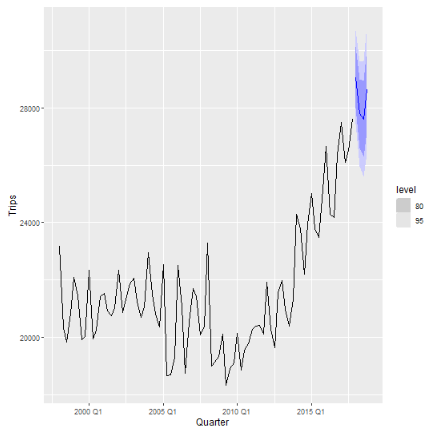

# Table of contents

<br>

1. [Basics](#basics)
2. [Tsibble](#tsibble)
3. [Fable](#fable)
4. [Coding style](#style)
5. [Summary](#summary)

---

# Our presentation in a nutshell

.pull-right-small-center[
<div align="center">
<br>

 <p style="text-align: center; font-size: 16px; font-weight:">image from: </p>
</div>
]

---
class: inverse, center, middle
name: tsibble

# Tsibble Basics: Introduction to the Tsibble Package for Time-Series Analysis
<html><div style='float:left'></div><hr color='#EB811B' size=1px style="width:1000px; margin:auto;"/></html>

---

# What is the Tsibble Package?

.pull-left[
### R Packages for Data Science

- Let's take it from the [tsibble website](https://tsibble.tidyverts.org/):

**"The tsibble package provides a data infrastructure for tidy temporal data with wrangling tools."**

]

---

# A Guide to Tsibble

### Valuable Resources

- [Tsibble : RDocumentation](https://www.rdocumentation.org/packages/tsibble/versions/1.1.3)
- [Tsibble : learn more about tsibble](https://tsibble.tidyverts.org/) 
- [Tsibble : tidy temporal data frames and tools](https://search.r-project.org/CRAN/refmans/tsibble/html/tsibble-package.html)
- [Tsibble](https://cran.microsoft.com/snapshot/2022-05-21/web/packages/tsibble/tsibble.pdf)

---

# Tsibble Package

### Installing and Loading the Tsibble Package

- You can install the `tsibble` package from CRAN using the install.packages("tsibble") command.

```{r, eval = FALSE}
install.packages("tsibble")
```

- To load the package, use the library(tsibble) function.

```{r, eval = FALSE}
library(tsibble)
```
---

# Purpose of the Tsibble Package

-Set of tools and functions for creating a structured framework for working with time-series data.

-Integrates information about time index, key, and other attributes to make it easier to work with time-based data.

-Wrangling tools to get data into a useful form for visualization and modeling.

-Part of the tidyverse, making it compatible with other tidyverse packages like ggplot2, dplyr, and tidyr.

---

# But what are time series?
### A reminder of time series data: Stats I and II

1. "Time series allows for delayed effects or effects that persist over time." Time series data is a sequence of observations collected over time.
2. In time series, there is a clear temporal ordering, and time series are indexed by time.
3. Examples in which time series are useful include studying the delayed effect of a gaffe by a political candidate on his popularity for a period.
4. It helps identify trends and make forecasts.

---

### Data Structure

A tsibble is an enhanced version of a data frame or tibble (i.e., a data structure part of the tidyverse, an alternative to a data frame) specifically designed for time series data. It integrates information about time index, key, and other attributes, making it easier to work with time-based data.

---

### Data Principles

- In tsibble :  [tidy data principles](https://tsibble.tidyverts.org/)

1.Index is a variable with inherent ordering from past to present.
2.Key is a set of variables that define observational units over time.
3. Each observation should be uniquely identified by index and key.
4. Each observational unit should be measured at a common interval, if regularly spaced.

---

# Key Features of "tsibble"

### *Index and Key*: 

The tsibble structure allows us to specify a time index and a key that uniquely identifies each time series in the data. It's designed to simplify time-series data handling and includes the temporal aspect of the data.

### *Time-Based Operations*: 

The package provides a range of operations for manipulating and transforming time series data, including handling irregular time intervals, filling gaps, and handling missing values.

### *Visualization*: 

The package includes functions for visualizing time series data, making it easier to explore and understand temporal patterns.

### *Compatibility*: 

Tsibble data objects work seamlessly with other time series analysis packages in R, such as forecast and fable.

---

### Why Should We Use It?

- Makes it easier to prepare time-series data for analysis.

- A good way to manipulate and visualize time-series data.

- Helps keep your code tidy and clean.

- Particularly useful when dealing with large volumes of time-series data.

---

# Example: Creating a Tsibble

.pull-left[
**Tsibble with Hypothetical Data**

---

Let's create a tsibble with a hypothetical dataset:

library(tsibble)
library(dplyr)

```{r, eval = FALSE}
# We first have to create a tsibble object.
# Create a dataframe sales_data with three columns: Date, Product_ID, and Sales.
sales_data <- data.frame(
  Date = seq.Date(from = as.Date("2023-01-01"), by = "1 day", length.out = 30),
  Product_ID = rep(1:3, each = 10),
  Sales = rnorm(30)
) %>%
  as_tsibble(index = Date, key = Product_ID)

# View the tsibble with head.
head(sales_data)
```

]

.pull-right[
**Visualization with Tsibble**

---

Tsibble can be used to create time-series visualizations. Here's an example using ggplot2:

```{r, eval = FALSE}
# We can create a line plot.
library(ggplot2)
sales_data %>%
  ggplot(aes(x = Date, y = Sales, color = as.factor(Product_ID))) + 
  geom_line() + 
  labs(title = "Sales over Time", x = "Date", y = "Sales")
```

]
---

With a Real Dataset: AirPassengers, monthly airline passenger numbers from 1949 to 1960:

```{r, eval = FALSE}
library(tsibbledata)

# Load the AirPassengers dataset
data("AirPassengers")

# Convert it to a tsibble
passenger_data <- AirPassengers %>%
  as_tsibble(index = Yearmonth)

# View the tsibble
head(passenger_data)
```

---

# Learn more about tsibble 

- There is a whole ecosystem the tidyverts, around the tsibble package, aiming to tidy time series analysis : 
  
  -The tsibbledata package which compiles various examples of tsibble data 
  
  -The feasts package which allows to visualize data and extract time series features 
  
  -The fable package which offers a popular forecasting techniques for tsibble including ARIMA and ETS while its foundation, the
  fabletools package, simplifies the modeling process when working with tsibble data. 
  
  We will now learn more about the fable package, but before this do you have questions on the tsibble package ? 
  
---

# FAQ

.pull-left[

<br>

**Q: **: What other packages work well with tsibble for time-series analysis?

A:  Tsibble is part of the tidyverse, so it integrates seamlessly with other tidyverse packages like ggplot2, dplyr, and tidyr. Additionally, tsibble is compatible with time-series analysis packages like forecast and fable.

**Q: ** Is tsibble suitable for handling large volumes of time-series data?

A: Yes, tsibble is a great choice for working with large volumes of time-series data. Its design principles make it efficient for managing and analyzing time-series data.

]

.pull-right[

<br>

**Q: ** Are there alternatives to dplyr for data wrangling when working with tsibble?

A: Yes, when dealing with large datasets, you might want to consider the data.table package as an alternative to dplyr. Another option is to use dtplyr, which is a data.table backend for dplyr. It automatically translates dplyr code to data.table code for faster performance.

]


---
class: inverse, center, middle
name: tidyr

# Presentation on Fable Package for Time series Forcasting

<html><div style='float:left'></div><hr color='#EB811B' size=1px style="width:1000px; margin:auto;"/></html>

---

# Time series Forecasting
.pull-right-small-center[
<div align="center">
<br>

 <p style="text-align: center; font-size: 16px; font-weight:">image from: Mitchell O'Hara-Wild</p>
</div>
]

.pull-left-wide[

`Time Series forecasting` is a crucial component of data analysis, enabling us to make predictions about future values based on historical data points. 

In R, the `fable` package provides a powerful framework for time series forecasting, making it easier than ever to create accurate and reliable forecasts.

The existing integration of modeling and the tidyverse is especially problematic for time series, as the input data structure(ts) is/are inherently untidy. 

Much like `tsibble` implements tidy time series data, the fable package applies tidyverse principles to time series modeling, making the forecasting workflow seamlessly integrate with other tidyverse packages. 

]

---

# Introduction to "fable"

.pull-right-small-center[
<div align="center">
<br>

 <p style="text-align: center; font-size: 16px; font-weight:">image from: Mitchell O'Hara-Wild</p>
</div>
]

`fable` is a comprehensive time series forecasting package in R, designed to make forecasting tasks more accessible, flexible, and efficient.

It extends the functionalities of the "forecast" package and the `tsibble` package, making it a versatile tool for time series analysis and forecasting.

The fable package provides some commonly used univariate and multivariate time series forecasting models which can be used with tidy temporal data in the tsibble format.

These models are used within a consistent and tidy modeling framework, allowing several models to be estimated, compared, combined, forecasted and otherwise worked across many time series.

**Note** The tidy models framework is a collection of R packages for modeling and machine learning using tidyverse principles 

---
# The Role of Fable in R

- Fable is an R package designed to streamline time series forecasting. It is built on top of the tidyverse, which makes it user-friendly and integrates seamlessly with other data manipulation and visualization tools in R.

- Fable provides a wide range of forecasting models and methods, from simple ones like exponential smoothing to more complex models such as ARIMA and state space models. This diversity of approaches allows users to choose the most appropriate model for their specific data set and forecasting needs.

- Additionally, Fable makes it easy to visualize forecasts, evaluate model performance, and create production-ready reports. With the `fable` package, you can unlock the power of time series forecasting in R to gain insights and make data-driven decisions.

**Installing and Loading**

You can install the `fable` package from CRAN using the install.packages("fable") command.

To load the package, use the library(fable) function.

It is crucial to have the `tsibble` package installed and loaded, as `fable` heavily relies on it for time series data manipulation.

---

# Key Features of "fable"

### Unified Framework:

This where fable seamlessly integrates with the `tsibble` package for easy manipulation of time series data. eg monthly sales data.This integration simplifies the entire process, from data import to modeling.

### State Space Models:

It offers advanced state space modeling, which can capture complex time series patterns and relationships.

- State-space models deal with dynamic time series problems that involve unobserved variables or parameters that describe the evolution in the state of the underlying system(Kevin Kotzé)

### Model Diagnostic Tools

`fable` includes an array of diagnostic tools to assess the quality and reliability of your forecasting models. 

These tools may include visualizations, such as residual plots and forecasting accuracy metrics, like Mean Absolute Error (MAE) and Root Mean Squared Error (RMSE), Cross-Validation, Autocorrelation etc. These diagnostics help you fine-tune your models.

---

# Key Features of "fable"

### Visualization:

The package empowers users with rich visualization capabilities, enabling a better understanding of time series data. Some commonly used packages with the fable are listed below:
 - Ggplot2
 
 - Ggfortify: This package allows us to blend the use of some basic functions with the package eg. autoplot() function with forecast objects.
 
 - feasts: stands for Feature Extraction and Statistics for Time Series, which is used for  extracting features from time series data and generating plots like seasonal decomposition plots and autocorrelation plots.
 
 - patchwork: allows you to combine and arrange multiple plots into a single, cohesive visualization. 

---
# Models Available in the “fable" package

The `fable` package in R provides a variety of time series models for forecasting. Some of the key models available in the `fable` package include:

 - ETS Models: it provides most flexible way of modeling error, trend and seasonal elements together.
 
 - ARIMA(p, d, q): Autoregressive integrated moving average model with specified order (p, d, q), where p,d,q represents autoregressive, integrated and moving average respectively.

 - PROPHET: Forecasting model developed by Facebook for time series with daily observations and multiple seasonality.

- Neural Network Models: regression models etc.


.pull-left-wide[

**What about fable ? **

A fable is never true, but it tells you something important about reality - and that’s what a forecast is. Rob Hyndman (2018-06-21)
]
.pull-right-small-center[
<div align="center">
<br>

 <p style="text-align: center; font-size: 16px; font-weight:">image from: worksheet planet</p>
</div>
]

---
# Forecasting with fable

```{r, include = T}
pacman::p_load(fable,tidyverse,tsibble)
```

It is a good practice to observe your data before you start to work with it (modelling).

```{r}
trips = tourism |> 
  summarise(Trips = sum(Trips))
#trips 

```


The terms used with the fable model somewhat include model specific functions called ‘specials, which describes how the time series dynamics are captured by a model.

`Fable` allows model specification that supports formula based interface. eg lm()

`ETS()` function `ref: page 55` is used to define `exponential smoothing models` which provides ‘specials’ for controlling the error(), trend() and season().

**Note** finding an appropriate model specification can be tricky as it requires some prior knowledge about temporal patterns. **Do not worry!** 

---
# Forecasting with fable
### Model specification:  
This is the process of defining and describing the structure, components, and assumptions of a statistical or mathematical model.

`ETS()` and other models automatically choose the best specification if several options are available. `fable` can determine if the seasonality is additive (season("A")) or multiplicative (season("M")), using:

`ETS(Trips ~ error("A") + trend("A") + season(c("A", "M")))` considering the tourist data in R

ETS model can be implement with:
`ETS(Trips)`

### Model Estimation
This training one or more unique models with a dataset. To do this we can use the `model()` function. eg:

---
# Forecasting with fable
.pull-left[
 - fitting a model with the fit `model()` function
```{r, include = T}
trips = tourism |> 
  summarise(Trips = sum(Trips))

fit = trips |> 
  model(auto_ets = ETS(Trips))
fit
```
The result informs us that model ETS(A,A,A) has been automatically selected. We can use the `report()` function to provide summary to our fit if we have only one model selected.
]
.pull-right[
---
# Forecasting with fable

```{r, include = T}
report(fit)
```

]

---
# Forecasting with fable
Fable also supports verbs from `broom package` which enable us to use various functions: `tidy()` your coefficients, `glance()` your model summary statistics, and `augment()` your data with predictions.

.pull-left[
 - **forecasting**

Use the `forecast()` function to produce a forecast for the estimated models.
```{r, include = T}
fore_cast = fit |> 
  forecast(h = "1 year")
fore_cast
```
]
.pull-right[
 - **Plot time series**
```{r, include = T}
#fore_cast |> 
  #autoplot(trips)
```

.pull-left[
<div align="center">
<br>

 <p style="text-align: center; font-size: 16px; font-weight:"> Time series plot</p>
</div>
]
]

---
# Forecasting with fable
You can also try forecasting with different models; eg ARIMA, TSLM (linear model) etc.

```{r, include = T}
fit = trips |> 
  model(
    arima = ARIMA(Trips),
    ets = ETS(Trips),
    lm = TSLM(Trips ~ trend() + season())
  )
fit
```

The results now show the 3 models. We can also make a plot with respect to each model.

---
# Forecasting with fable
```{r, include = T}
#fit |> 
  #forecast(h = "3 year") |>
 # autoplot((trips), level = 60, alpha = 0.5)
```
.pull-left[
.pull-center[
<div align="center">
<br>

 <p style="text-align: center; font-size: 16px; font-weight:"> Time series plot</p>
</div>
]
]
.pull-right[
**Final comment**
A lot more could be done with respect to whatever your problem set maybe.
- Forecasting (forecast())
- Missing value interpolation (interpolate())
- Reporting model output (report())
- Simulation of future paths (generate())
- Streaming new data (stream())
- Re-estimation (refit())
- Decomposition of model components (components())
- Model equation output (equation())
- Broom verbs (augment(), coef()/tidy(), glance())
- Model fits (fitted(), residuals())
]

---

# FAQ

.pull-left[

<br>

**Q:  **

A: 

**Q: **

A:
]

.pull-right[

<br>

**Q:**

A: 
  
**Q:**

]

